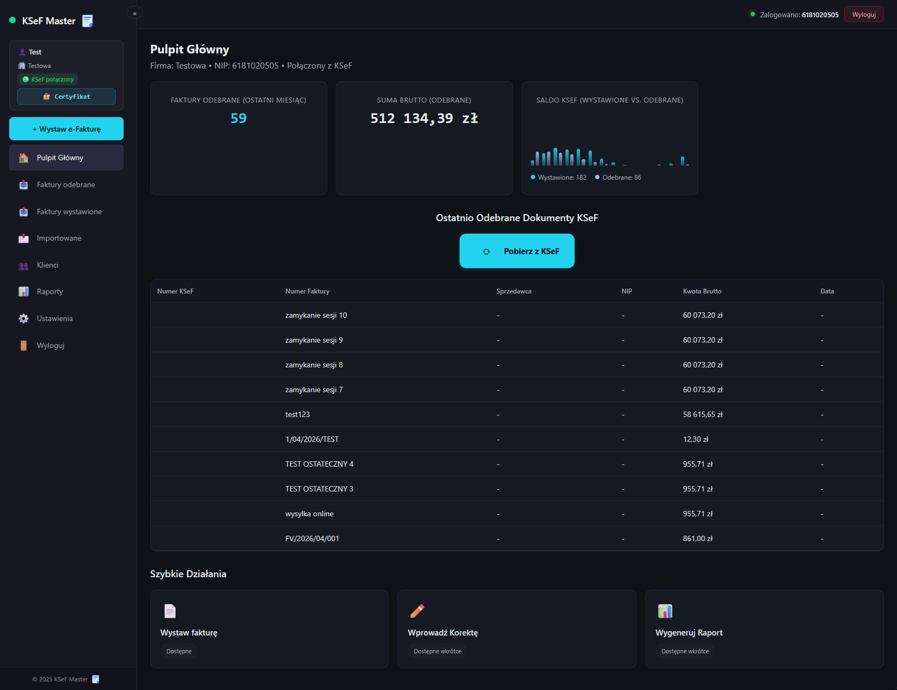
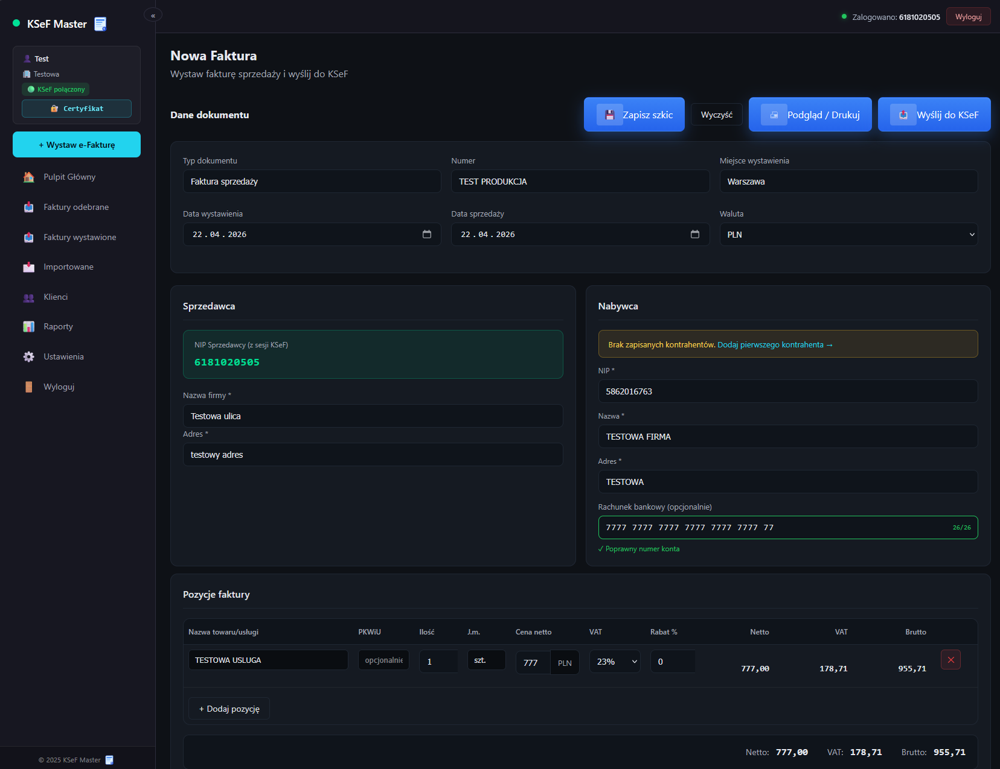
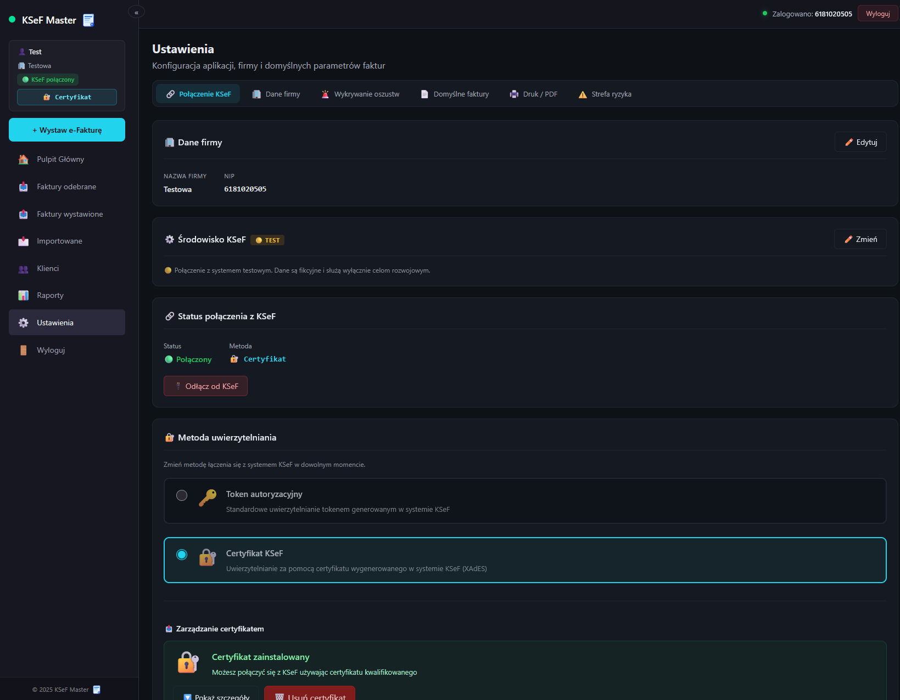
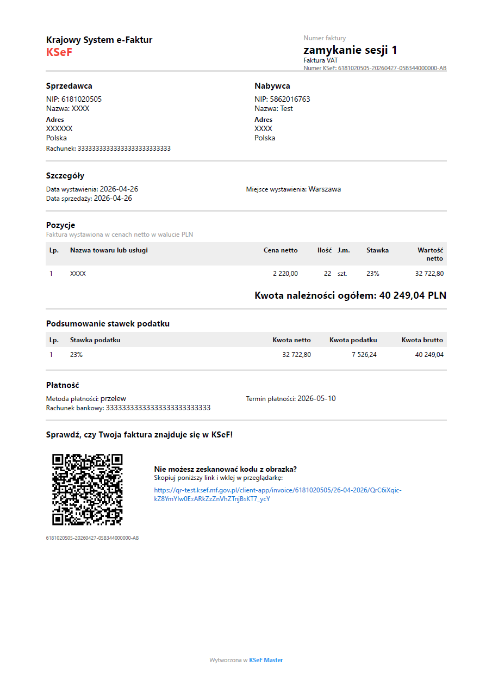
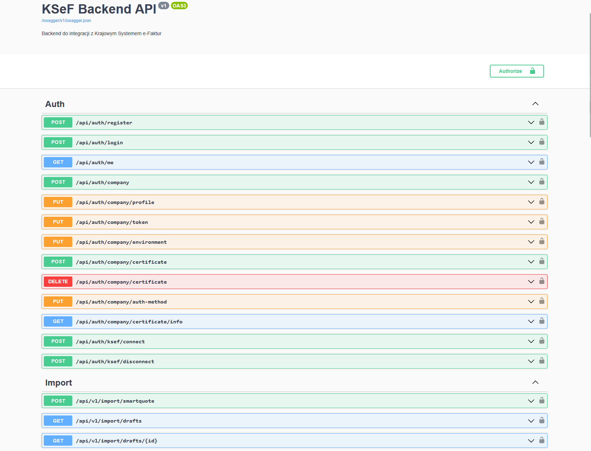

# KSeF Master — Backend API

<div align="center">


**Backend API for KSeF Master — a professional invoicing platform integrating with the Polish National e-Invoice System (KSeF API v2)**

[🌐 Live Application](https://ksef-master.netlify.app) · [📦 Frontend Repository](https://github.com/Shellty-IT/KSeF-Master) · [📖 API Docs (Swagger)](#api-documentation)

</div>

---

## 📋 Table of Contents

- [Overview](#-overview)
- [Screenshots](#-screenshots)
- [Architecture](#-architecture)
- [Tech Stack](#-tech-stack)
- [Project Structure](#-project-structure)
- [Authentication Model](#-authentication-model)
- [API Reference](#-api-reference)
- [Database Schema](#-database-schema)
- [Invoice Synchronization](#-invoice-synchronization)
- [Security](#-security)
- [Configuration](#-configuration)
- [Docker Deployment](#-docker-deployment)
- [Getting Started](#-getting-started)
- [Author](#-author)

---

## 🧭 Overview

**KSeF Master Backend** is a production-ready REST API built with **.NET 8**, serving as the backbone of the KSeF Master invoicing platform. It provides full integration with the **Polish Ministry of Finance KSeF API v2**, handling:

- Two-layer authentication (app-level JWT + KSeF-level token/certificate)
- Secure invoice synchronization with delta strategy and 3-month window handling
- Invoice sending with full XAdES-BES signing support (ECDSA & RSA)
- PDF generation with QR codes
- Persistent invoice cache in PostgreSQL (Neon serverless)
- AES-256-CBC encryption for all sensitive KSeF credentials

The system is designed with clean architecture principles — Repository Pattern, Facade Pattern, strict SRP, and interface-segregation throughout.

---

## 📸 Screenshots

> Screenshots of the live application — [https://ksef-master.netlify.app](https://ksef-master.netlify.app)

<br/>

**Dashboard — Invoice Overview**
<!-- Add screenshot here -->


<br/>

**Invoice Details View**
<!-- Add screenshot here -->


<br/>

**Company & KSeF Configuration**
<!-- Add screenshot here -->


<br/>

**PDF Export with QR Code**
<!-- Add screenshot here -->


<br/>

**Swagger API Documentation**
<!-- Add screenshot here -->


---

## 🏗 Architecture

KSeF Master Backend follows a **layered, service-oriented architecture** with strict separation of concerns.

### Layers

**1. Controllers**
- `AuthController` - app authentication, company configuration
- `KSeFController` - full KSeF API v2 integration
- `ImportController` - external import (SmartQuote)

**2. Service Layer**

| Group | Services |
|---|---|
| Auth | `UserAuthService`, `JwtService`, `CompanyService`, `CertificateService`, `TokenEncryptionService` |
| KSeF Auth | `KSeFAuthService`, `KSeFChallengeService`, `KSeFAuthPollingService`, `KSeFAuthRedeemService`, `KSeFTokenRefreshService` |
| KSeF Certificate | `KSeFCertAuthService` |
| KSeF Invoice | `KSeFInvoiceFacade`, `KSeFInvoiceQueryService`, `KSeFInvoiceSendService`, `KSeFInvoiceDetailsService`, `KSeFInvoiceStatsService` |
| KSeF Session | `KSeFOnlineSessionService`, `KSeFSessionManager` |
| KSeF Common | `KSeFCryptoService`, `KSeFEnvironmentService` |
| PDF | `PdfGeneratorService`, `PdfDocumentComposer`, `PdfQrCodeGenerator`, `PdfSectionRenderer` |
| Shared Infrastructure | `KSeFErrorParser`, `KSeFResponseLogger`, `KSeFApiException` |

**3. Repository Layer**

| Interface | Responsibility |
|---|---|
| `IUserRepository` | User CRUD |
| `ICompanyRepository` | Company profile management |
| `IInvoiceRepository` | Invoice persistence & queries |

**4. Database**
PostgreSQL hosted on **Neon (serverless)** — tables: `Users`, `CompanyProfiles`, `Invoices`

---

### Key Architectural Patterns

| Pattern | Application |
|---|---|
| **Repository Pattern** | All DB access via repository interfaces — services never touch `DbContext` directly |
| **Facade Pattern** | `KSeFInvoiceFacade` delegates to dedicated services (query, details, stats, session, send) |
| **SRP** | Each service has exactly one responsibility |
| **ISP** | Controllers inject only the interfaces they actually need |
| **Shared Infrastructure** | Single `KSeFErrorParser`, `KSeFResponseLogger`, `KSeFApiException` used across all KSeF services |


### Key Architectural Decisions

| Pattern | Application |
|---|---|
| **Repository Pattern** | All DB access via `IUserRepository`, `ICompanyRepository`, `IInvoiceRepository` |
| **Facade Pattern** | `KSeFInvoiceFacade` delegates to query, details, stats, session, send services |
| **SRP** | Each service has exactly one responsibility |
| **ISP** | Controllers inject only interfaces they need |
| **Shared Infrastructure** | Single `KSeFErrorParser`, `KSeFResponseLogger`, `KSeFApiException` |

---

## 🛠 Tech Stack

| Layer | Technology | Version |
|---|---|---|
| Runtime | .NET / ASP.NET Core | 8.0 |
| Language | C# | 12.0 |
| ORM | Entity Framework Core | 8.0 |
| Database | PostgreSQL (Neon serverless) | — |
| DB Driver | Npgsql.EntityFrameworkCore.PostgreSQL | 8.0.4 |
| Authentication | JWT Bearer | 8.0.0 |
| Password Hashing | BCrypt.Net-Next | 4.0.3 |
| Encryption | AES-256-CBC (built-in) | — |
| Signing | XAdES-BES (ECDSA + RSA) | — |
| Validation | FluentValidation.AspNetCore | 11.3.0 |
| PDF Generation | QuestPDF | 2024.3.0 |
| QR Codes | QRCoder | 1.6.0 |
| API Docs | Swashbuckle / Swagger | 6.5.0 |
| Containerization | Docker (Linux) | — |
| Deployment | Render.com | — |

---

## 📁 Project Structure
KSeF_Backend/
├── Controllers/
│ ├── AuthController.cs
│ ├── KSeFController.cs
│ └── ImportController.cs
│
├── Infrastructure/
│ ├── Extensions/
│ └── KSeF/
│ ├── KSeFApiException.cs
│ ├── KSeFErrorParser.cs
│ ├── KSeFHttpLoggingHandler.cs
│ └── KSeFResponseLogger.cs
│
├── Models/
│ ├── Data/
│ │ ├── AppDbContext.cs
│ │ ├── User.cs
│ │ ├── CompanyProfile.cs
│ │ └── Invoice.cs
│ ├── Requests/
│ └── Responses/
│
├── Repositories/
│ ├── IUserRepository.cs
│ ├── UserRepository.cs
│ ├── ICompanyRepository.cs
│ ├── CompanyRepository.cs
│ ├── IInvoiceRepository.cs
│ └── InvoiceRepository.cs
│
├── Services/
│ ├── Auth/
│ ├── KSeF/
│ │ ├── Auth/
│ │ ├── Certificate/
│ │ ├── Common/
│ │ ├── Invoice/
│ │ └── Session/
│ ├── Pdf/
│ ├── Invoice/
│ └── External/
│
├── Validators/
├── Mappers/
├── Migrations/
├── Program.cs
├── appsettings.json
├── Dockerfile
└── KSeF_Backend.csproj
---

## 🔐 Authentication Model

The system implements a **two-layer authentication model**:

### Layer 1 — Application Authentication
- Email + password registration & login
- Passwords hashed with **BCrypt**
- Session managed via **JWT Bearer tokens** (24h expiry)
- Users can access the app without KSeF connected

### Layer 2 — KSeF Authentication
- Per-company configuration, independent from app login
- Two supported methods:

| Method | Details |
|---|---|
| **Token** | KSeF-issued access token, AES-256-CBC encrypted at rest |
| **Certificate** | PEM format (ECDSA or RSA), XAdES-BES signing, serial number in decimal |

- All sensitive data (tokens, certificates, private keys) stored **AES-256-CBC encrypted** in PostgreSQL
- KSeF auth follows challenge → sign → redeem → token flow

---

📡 API Reference — poprawiona (EN)
Markdown

## 📡 API Reference

All responses follow a unified format:

```json
{
  "success": true,
  "data": {},
  "message": "...",
  "error": null
}
Auth Endpoints — /api/auth
Method	Endpoint	Access	Description
POST	/api/auth/register	Public	Register new user
POST	/api/auth/login	Public	Login, receive JWT
GET	/api/auth/status	JWT	Full auth status
POST	/api/auth/company/setup	JWT	Configure company & NIP
POST	/api/auth/ksef/connect	JWT	Connect KSeF token
POST	/api/auth/ksef/disconnect	JWT	Disconnect KSeF
POST	/api/auth/certificate/upload	JWT	Upload PEM certificate
DELETE	/api/auth/certificate	JWT	Delete certificate
GET	/api/auth/certificate/info	JWT	Certificate metadata
POST	/api/auth/ksef/environment	JWT	Switch Test / Production
KSeF Endpoints — /api/ksef
Method	Endpoint	Access	Description
GET	/api/ksef/status	Public	Server & session status
POST	/api/ksef/login	JWT	Authenticate to KSeF
POST	/api/ksef/logout	JWT	Logout from KSeF
GET	/api/ksef/invoices/cached	JWT	Get cached invoices from DB
POST	/api/ksef/invoices/sync	JWT	Force full delta sync
POST	/api/ksef/invoices	JWT	Sync and return invoices
GET	/api/ksef/invoices/stats	JWT	Invoice statistics
GET	/api/ksef/invoice/{ksefNumber}	JWT	Single invoice details
POST	/api/ksef/invoice/send	JWT	Send invoice to KSeF
POST	/api/ksef/invoice/pdf	JWT	Generate PDF with QR code
POST	/api/ksef/session/open	JWT	Open online session
POST	/api/ksef/session/close	JWT	Close online session
POST	/api/ksef/session/close-and-upo	JWT	Close session and fetch UPO
KSeF Environments
Environment	Base URL
Test	https://api-test.ksef.mf.gov.pl/v2/
Production	https://api.ksef.mf.gov.pl/v2/
  }
}
Required environment variables:

Variable	Description
ConnectionStrings__DefaultConnection	Neon PostgreSQL connection string
Jwt__Key	JWT signing key (min. 32 chars)
Encryption__Key	AES-256 encryption key
PORT	HTTP port (default: 8080)
🐳 Docker Deployment
The project uses a multi-stage Docker build for minimal production image size.

Dockerfile

# Build stage — full SDK
FROM mcr.microsoft.com/dotnet/sdk:8.0 AS build

# Runtime stage — minimal ASP.NET runtime only
FROM mcr.microsoft.com/dotnet/aspnet:8.0 AS runtime
Build & run locally:

Bash

# Build image
docker build -t ksef-backend .

# Run container
docker run -p 8080:8080 \
  -e ConnectionStrings__DefaultConnection="your-neon-connection-string" \
  -e Jwt__Key="your-jwt-secret-key" \
  -e Encryption__Key="your-encryption-key" \
  ksef-backend
Production deployment: Render.com (auto-deploy from Docker)

🚀 Getting Started
The application is already live at https://ksef-master.netlify.app

The following steps are for local development.

Prerequisites
.NET 8 SDK
PostgreSQL or Neon account
Docker (optional)
Local Setup
1. Clone the repository

Bash

git clone https://github.com/Shellty-IT/KSeF-Master_backend.git
cd KSeF-Master_backend
2. Create appsettings.Development.json

JSON

{
  "ConnectionStrings": {
    "DefaultConnection": "Host=...;Database=ksef_master;Username=...;Password=..."
  },
  "Jwt": {
    "Key": "your-local-dev-secret-key-minimum-32-chars"
  },
  "Encryption": {
    "Key": "your-local-encryption-key-32chars"
  }
}
3. Apply database migrations

Bash

dotnet ef database update
Migrations also run automatically on startup.

4. Run the API

Bash

dotnet run
5. Open Swagger

http://localhost:8080/swagger
🗺 Roadmap
 Full KSeF API v2 integration
 JWT authentication
 Two-layer auth (app + KSeF)
 PostgreSQL persistence (Neon)
 Delta invoice synchronization
 XAdES-BES certificate signing
 PDF generation with QR codes
 Docker deployment
 FluentValidation full separation
 Unit & integration tests
 Fraud detection module
 Contractor database
 SmartQuote integration
 Production Neon branch separation
👤 Author
Shellty

Backend built with precision, designed for production.

<div align="center">
© 2024 Shellty — All rights reserved.

</div> ```